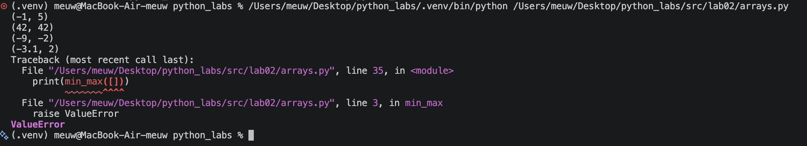

# Лабораторная работа 2
## Задание 1

def min_max(nums: list[float | int]) -> tuple[float | int, float | int]:
    if len(nums) == 0:
        raise ValueError

    minimum = min(nums)
    maximum = max(nums)

    return minimum, maximum

