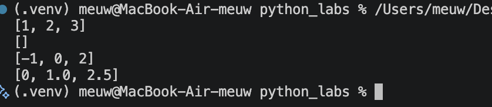
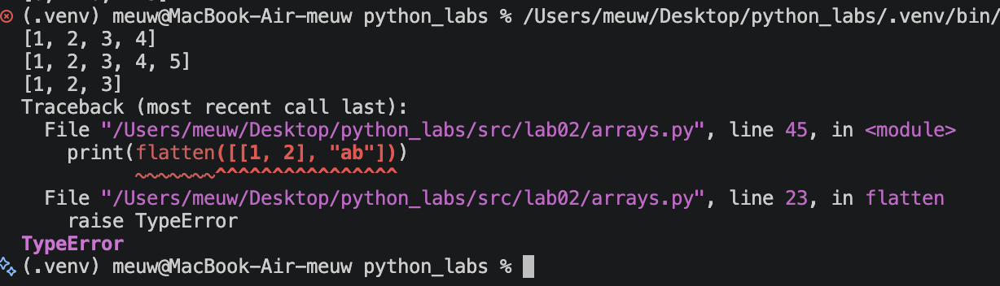
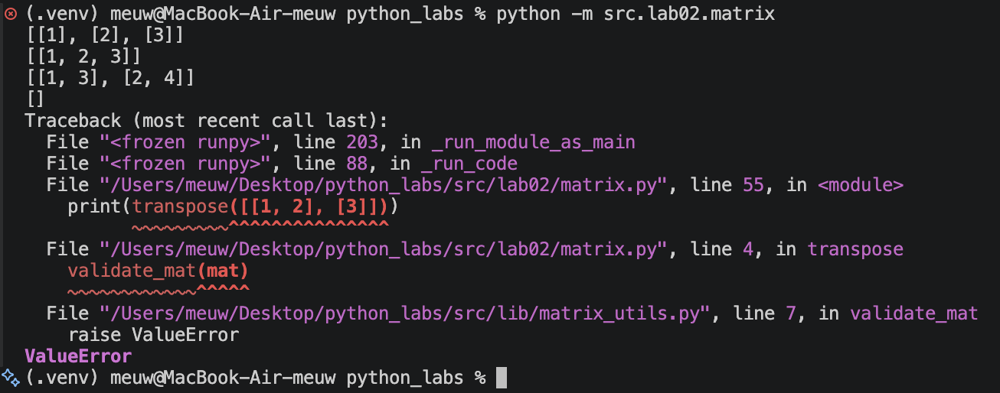
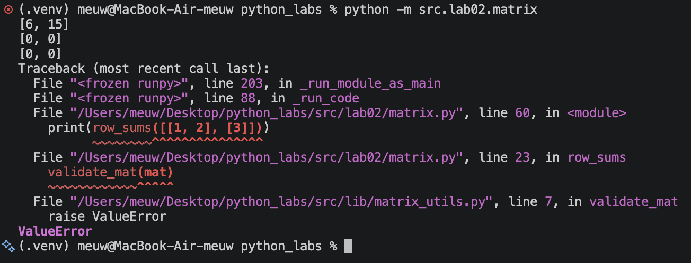
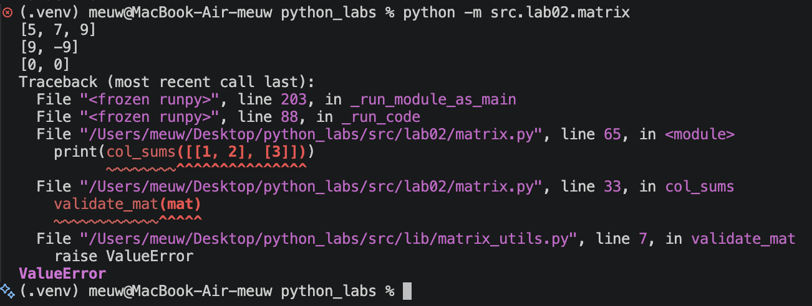
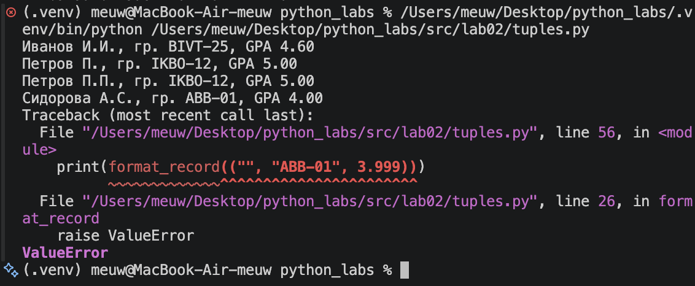
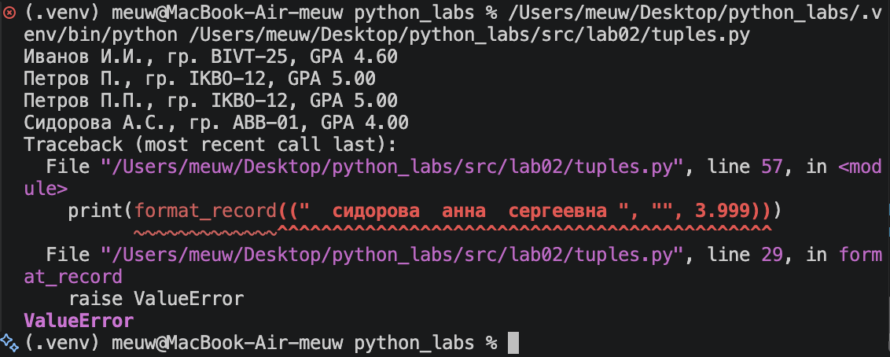
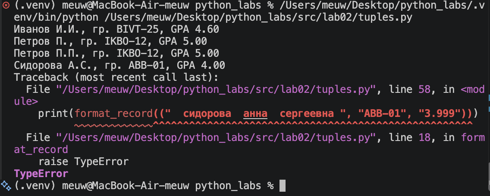

# Лабораторная работа 2
## Задание 1
```python
def min_max(nums: list[float | int]) -> tuple[float | int, float | int]:
    if len(nums) == 0:
        raise ValueError

    minimum = min(nums)
    maximum = max(nums)

    return minimum, maximum
```


```python
def unique_sorted(nums: list[float | int]) -> list[float | int]:

    result = sorted(set(nums))

    return result
```


```python
def flatten(mat: list[list | tuple]) -> list:

    result = []

    for row in mat:
        if not isinstance(row, (list, tuple)):
            raise TypeError

        result.extend(row)

    return result
```


## Задание 2
```python
from src.lib.matrix_utils import validate_mat
def transpose(mat: list[list[float | int]]) -> list[list]:
    validate_mat(mat)

    if len(mat) == 0:
        return []
    
    result = []

    row_count = len(mat)
    column_count = len(mat[0])

    for i in range(column_count):
        new_row = []
        for j in range(row_count):
            element = mat[j][i]
            new_row.append(element)
        result.append(new_row)
    return result
```


```python
def row_sums(mat: list[list[float | int]]) -> list[float]:
    validate_mat(mat)

    result = []

    for row in mat:
        row_sum = sum(row)
        result.append(row_sum)
    return result
```


```python
def col_sums(mat: list[list[float | int]]) -> list[float]:
    validate_mat(mat)

    if len(mat) == 0:
        return []

    result = []

    column_count = len(mat[0])

    for column_index in range(column_count):
        column_sum = 0
        for row in mat:
            column_sum += row[column_index]
        result.append(column_sum)
    return result
```

## Задание 3
```python
def format_record(rec: tuple[str, str, float]) -> str:

    # Проверяем количество элементов
    if len(rec) != 3:
        raise ValueError

    # Получаем ФИО, группу и GPA
    fio, group, gpa = rec

    # Проверяем типы
    if not isinstance(fio, str):
        raise TypeError

    if not isinstance(group, str):
        raise TypeError

    if not isinstance(gpa, (int, float)):
        raise TypeError

    # Убираем лишние пробелы
    fio = " ".join(fio.split())
    group = group.strip()

    # Проверяем, что ФИО и группа не пустые
    if not fio:
        raise ValueError

    if not group:
        raise ValueError

    # Разделяем ФИО на слова
    parts = fio.split()

    # нужно указать минимум фамилию и имя
    if len(parts) < 2:
        raise ValueError

    # Первое слово — фамилия
    surname = parts[0].capitalize()

    # Получаем инициалы имени и отчества
    initials = ""

    for word in parts[1:3]:
        initials += word[0].upper() + "."

    # Формируем результат
    return f"{surname} {initials}, гр. {group}, GPA {gpa:.2f}"
    print(format_record(("Иванов Иван Иванович", "BIVT-25", 4.6)))
    print(format_record(("Петров Пётр", "IKBO-12", 5.0)))
    print(format_record(("Петров Пётр Петрович", "IKBO-12", 5.0)))
    print(format_record(("  сидорова  анна  сергеевна ", "ABB-01", 3.999)))
    print(format_record(("", "ABB-01", 3.999)))
```


```python
    print(format_record(("Иванов Иван Иванович", "BIVT-25", 4.6)))
    print(format_record(("Петров Пётр", "IKBO-12", 5.0)))
    print(format_record(("Петров Пётр Петрович", "IKBO-12", 5.0)))
    print(format_record(("  сидорова  анна  сергеевна ", "ABB-01", 3.999)))
    print(format_record(("  сидорова  анна  сергеевна ", "", 3.999)))
```


```python
def format_record(rec: tuple[str, str, float]) -> str:

    # Проверяем количество элементов
    if len(rec) != 3:
        raise ValueError

    # Получаем ФИО, группу и GPA
    fio, group, gpa = rec

    # Проверяем типы
    if not isinstance(fio, str):
        raise TypeError

    if not isinstance(group, str):
        raise TypeError

    if not isinstance(gpa, (int, float)):
        raise TypeError

    # Убираем лишние пробелы
    fio = " ".join(fio.split())
    group = group.strip()

    # Проверяем, что ФИО и группа не пустые
    if not fio:
        raise ValueError

    if not group:
        raise ValueError

    # Разделяем ФИО на слова
    parts = fio.split()

    # нужно указать минимум фамилию и имя
    if len(parts) < 2:
        raise ValueError

    # Первое слово — фамилия
    surname = parts[0].capitalize()

    # Получаем инициалы имени и отчества
    initials = ""

    for word in parts[1:3]:
        initials += word[0].upper() + "."

    # Формируем результат
    return f"{surname} {initials}, гр. {group}, GPA {gpa:.2f}"


if __name__ == "__main__":
    print(format_record(("Иванов Иван Иванович", "BIVT-25", 4.6)))
    print(format_record(("Петров Пётр", "IKBO-12", 5.0)))
    print(format_record(("Петров Пётр Петрович", "IKBO-12", 5.0)))
    print(format_record(("  сидорова  анна  сергеевна ", "ABB-01", 3.999)))
    print(format_record(("  сидорова  анна  сергеевна ", "ABB-01", "3.999")))
```



